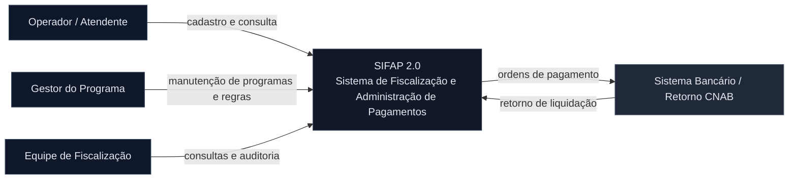
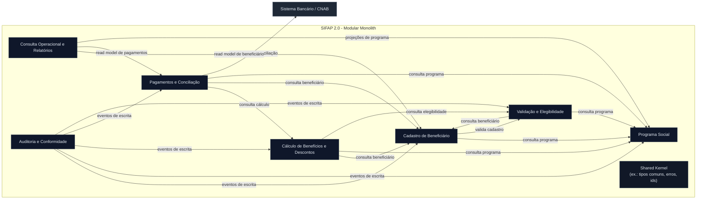

# SIFAP 2.0 - Mapa C4

## Premissas

- O alvo é um Modular Monolith em uma única aplicação Spring Boot.
- Cada bounded context é um módulo interno, com fronteiras explícitas de domínio.
- A comunicação entre contextos é in-process, via interfaces, serviços de aplicação ou eventos de domínio.
- O legado Adabas sugere ownership claro por DDM: BENEFICIARIO, PROGRAMA-SOCIAL, PAGAMENTO e AUDITORIA.

## C4 - Nível 1: System Context

## C4 - Nível 2: Containers / Bounded Contexts

## Bounded Contexts Finais

### 1. Cadastro de Beneficiário

- **Responsabilidade:** manter o cadastro mestre do beneficiário, seus dados pessoais, endereço, dependentes e vínculos operacionais.
- **Entidades:** Beneficiario, Dependente, DocumentoCadastral, Endereco, VinculoPrograma.
- **Serviços expostos:** cadastrar beneficiário, alterar beneficiário, consultar cadastro, manter dependentes, ativar/inativar cadastro.
- **Dependências de outros contextos:** consulta Programa Social para vinculação; consulta Validação e Elegibilidade antes de persistir alterações críticas.

### 2. Programa Social

- **Responsabilidade:** manter programas, parâmetros, limites e regras base de elegibilidade do benefício.
- **Entidades:** ProgramaSocial, RegraPrograma, ParametroPrograma, LimiteBeneficio.
- **Serviços expostos:** cadastrar programa, consultar programa, atualizar parâmetros, habilitar/desabilitar programa.
- **Dependências de outros contextos:** serve como referência para Cadastro de Beneficiário, Validação e Elegibilidade, Cálculo e Pagamentos; não depende de outros contextos centrais.

### 3. Validação e Elegibilidade

- **Responsabilidade:** validar documentos, consistência cadastral e elegibilidade do beneficiário em relação ao programa.
- **Entidades:** ResultadoValidacao, RegraValidacao, DecisaoElegibilidade, PendenciaValidacao.
- **Serviços expostos:** validar cadastro, validar documentos, avaliar elegibilidade, bloquear/liberar processamento.
- **Dependências de outros contextos:** depende de Cadastro de Beneficiário e Programa Social; alimenta Cálculo de Benefícios e Descontos e Pagamentos e Conciliação.

### 4. Cálculo de Benefícios e Descontos

- **Responsabilidade:** calcular valor bruto, descontos, correções, abonos e valor líquido do pagamento.
- **Entidades:** CalculoBeneficio, RegraDesconto, AjusteRetroativo, ComposicaoValor.
- **Serviços expostos:** calcular benefício, calcular desconto, recalcular correção, simular valor líquido.
- **Dependências de outros contextos:** depende de Cadastro de Beneficiário, Programa Social e Validação e Elegibilidade; publica resultados para Pagamentos e Conciliação.

### 5. Pagamentos e Conciliação

- **Responsabilidade:** gerar pagamentos, atualizar status, registrar liquidação, conciliar retorno bancário e tratar divergências.
- **Entidades:** Pagamento, LotePagamento, RetornoBancario, DivergenciaPagamento, StatusPagamento.
- **Serviços expostos:** gerar ciclo de pagamento, registrar pagamento, atualizar status, conciliar retorno bancário, consultar situação do pagamento.
- **Dependências de outros contextos:** depende de Cálculo de Benefícios e Descontos, Cadastro de Beneficiário e Programa Social; envia eventos para Auditoria e Conformidade.

### 6. Consulta Operacional e Relatórios

- **Responsabilidade:** fornecer visão de leitura para consulta de beneficiários, relatórios analíticos e painéis operacionais.
- **Entidades:** VisaoBeneficiario, VisaoPagamento, RelatorioGerencial, SnapshotConsulta.
- **Serviços expostos:** consultar beneficiário, consultar pagamentos, emitir relatórios por período, consolidar totais por região/status.
- **Dependências de outros contextos:** consome dados projetados de Cadastro de Beneficiário, Pagamentos e Conciliação e Programa Social; não escreve em domínios centrais.

### 7. Auditoria e Conformidade

- **Responsabilidade:** registrar trilha de alterações, emitir relatórios de auditoria e preservar histórico para fiscalização.
- **Entidades:** EventoAuditoria, TrilhasAuditoria, SumarioAuditoria.
- **Serviços expostos:** registrar evento de auditoria, consultar trilha, emitir relatório de auditoria.
- **Dependências de outros contextos:** depende de eventos de escrita de todos os contextos mutáveis; é transversal, mas mantém ownership próprio da trilha.

## Comunicação Entre Contextos

| De | Para | Mecanismo | Dados |
| --- | ---- | --------- | ----- |
| Cadastro de Beneficiário | Programa Social | Interface de aplicação | codigoPrograma, status, parametros de referência |
| Cadastro de Beneficiário | Validação e Elegibilidade | Chamada in-process | cpf, dados cadastrais, dependentes |
| Validação e Elegibilidade | Cálculo de Benefícios e Descontos | Retorno de decisão | resultado, justificativa, restrições |
| Cálculo de Benefícios e Descontos | Pagamentos e Conciliação | Serviço de aplicação | valor bruto, descontos, valor líquido, competência |
| Pagamentos e Conciliação | Auditoria e Conformidade | Evento de domínio | tipoEvento, entidade, chave, antes/depois |
| Consulta Operacional e Relatórios | Demais contextos | Read model / projeções | snapshots, sem escrita |

## Leitura Arquitetural

- `BENEFICIARIO.ddm` sustenta Cadastro de Beneficiário.
- `PROGRAMA-SOCIAL.ddm` sustenta Programa Social.
- `PAGAMENTO.ddm` sustenta Cálculo, Pagamentos e parte de Consulta.
- `AUDITORIA.ddm` sustenta Auditoria e Conformidade.

## Decisão

Este C4 preserva o que o legado já mostra: um núcleo transacional em torno de beneficiário, programa e pagamento, com validação e auditoria como capacidades separadas. A fronteira entre contextos foi desenhada para minimizar dependência cruzada de escrita e maximizar ownership claro de dados.
